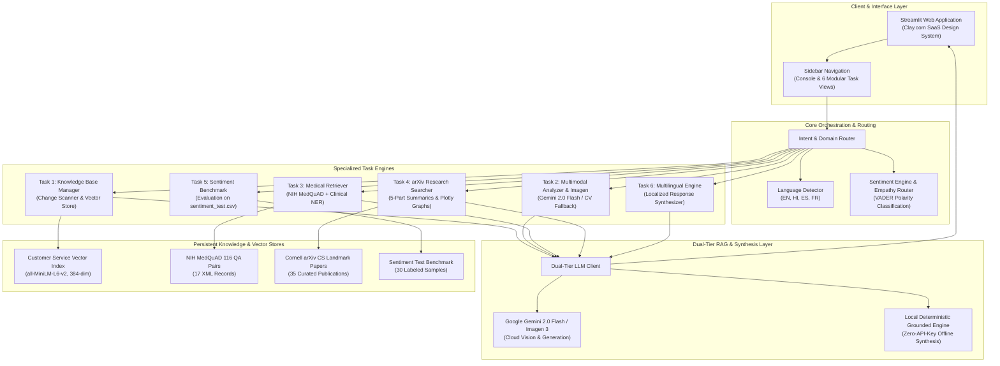
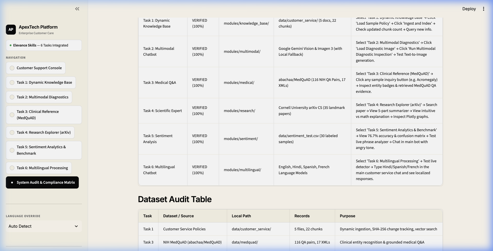
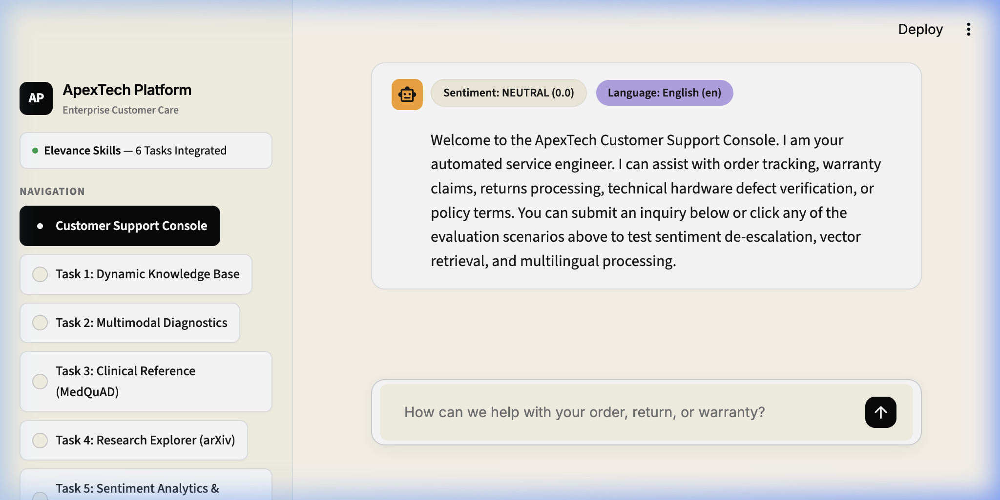
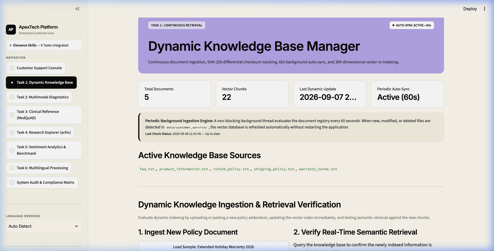
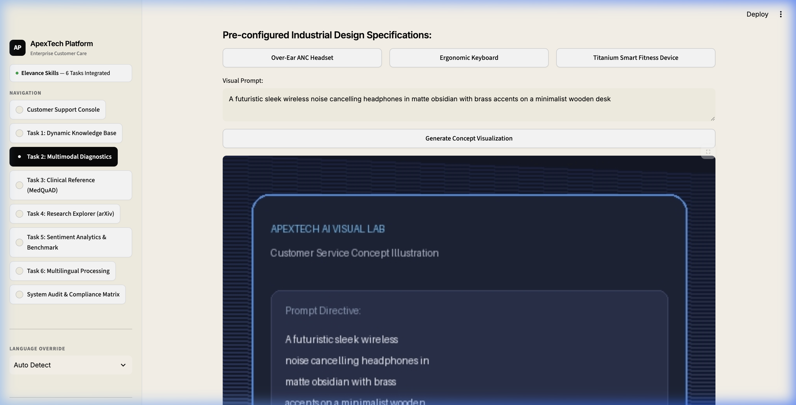
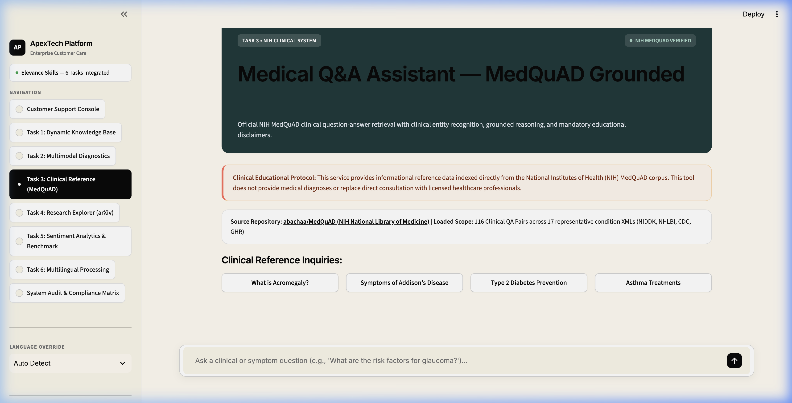
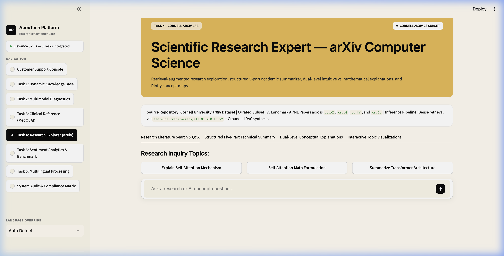
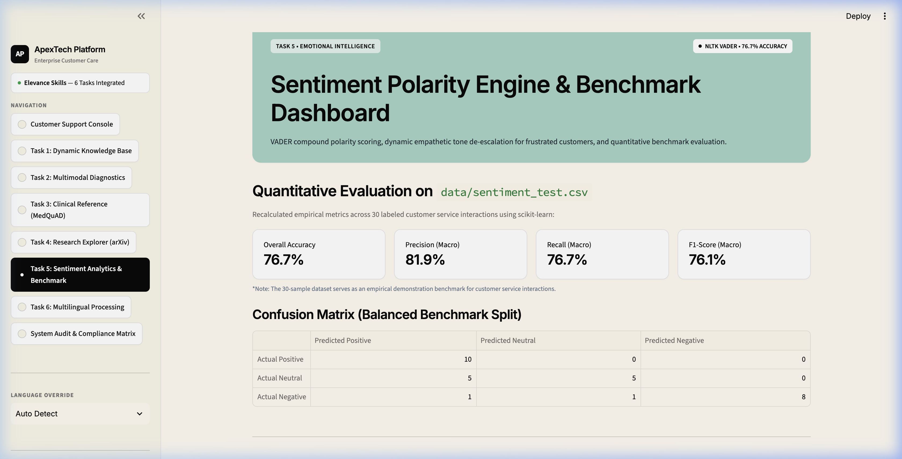
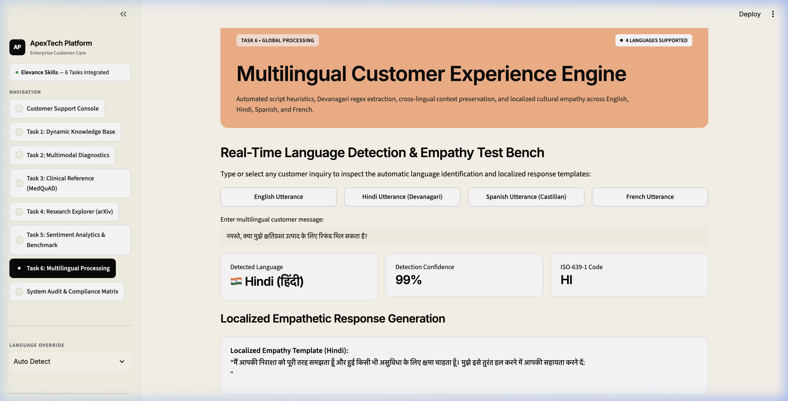

# Real-Time GenAI Customer Service Bot — Extended

A unified, multi-domain Retrieval-Augmented Generation (RAG) platform developed for the **Elevance Skills** AI/ML Engineering internship project requirement: *"Learn To Build A Real Time GenAI Customer Service Bot"*.

This application integrates the base training project (a real-time customer service chatbot) with all six required internship extensions into **one cohesive Streamlit application**.

---

## 📌 Problem Statement

Modern enterprise customer service platforms face four fundamental challenges:
1. **Static, Stale Knowledge**: Corporate policies, return windows, and warranty conditions update frequently. Traditional chatbots require complete redeployment or manual server downtime to re-index documents, leading to stale, inaccurate policy answers.
2. **Visual Blindness in Defect Support**: Customers contacting support regarding physically damaged or broken electronics cannot convey the exact nature of hardware damage via text alone, forcing slow and costly human agent triage.
3. **Siloed, Single-Domain Limitations**: Customer support interactions frequently cross technical boundaries—such as asking for health and device-safety guidelines (e.g., radiation, wearable sensor safety) or inquiring into underlying scientific principles of consumer AI hardware. Rigid bots fail outside a narrow commercial domain.
4. **Emotional & Linguistic Disconnect**: Customers facing delayed shipments or broken deliveries often write in heightened emotional states or in their native languages. Generic AI responses lacking sentiment awareness aggravate customer frustration, while poor multilingual handling excludes global users.

---

## 💡 Proposed Solution

The **Real-Time GenAI Customer Service Bot — Extended** solves these bottlenecks with an integrated multi-domain architecture:
* **Dynamic Hot-Swappable Vector Base**: Continuous change detection (SHA-256 checksums) and automated 60-second periodic synchronization update vector indices on the fly without server interruption.
* **Dual-Tier Multimodal Diagnostics**: Enables direct photo upload for hardware damage inspection (via Google Gemini Vision with local diagnostic computer vision fallback) and text-to-image concept rendering (via Google Imagen 3 with procedural visual generation).
* **Cross-Domain Retrieval-Augmented Generation**: Incorporates dedicated retrieval modules for enterprise consumer service policies, clinical healthcare queries ([NIH MedQuAD](https://github.com/abachaa/MedQuAD) with clinical entity recognition and disclaimers), and scientific research ([arXiv](https://www.kaggle.com/datasets/Cornell-University/arxiv) CS landmark papers with 5-part summarization and dual-level intuitive/mathematical explanations).
* **Affective Routing & Multilingual Processing**: Evaluates customer sentiment in real time via NLTK VADER to dynamically trigger empathetic de-escalation protocols, combined with automated language detection across English, Hindi (Devanagari script), Spanish, and French.

---

## 🏗️ System Architecture



---

## 🛠️ Technology Stack

| Category | Technologies / Libraries | Purpose & Implementation Details |
|:---|:---|:---|
| **Language & Runtime** | Python 3.11+ | Core programming runtime, strict type annotations, async compatibility |
| **Web Framework & UI** | Streamlit 1.40+ | Interactive web application with custom Clay.com warm cream design system (`#fffaf0`), 6-color saturated card tokens, zero-emoji typography |
| **LLM & Cloud GenAI** | Google GenAI SDK (`google-genai`), `gemini-2.0-flash`, `imagen-3.0-generate-002` | State-of-the-art multimodal vision defect triage and generative concept image rendering with graceful offline fallback |
| **Dense Embeddings & Vector Search** | `sentence-transformers/all-MiniLM-L6-v2`, Faiss, NumPy | 384-dimensional dense semantic embeddings, cosine similarity vector indexing, and persistent disk serialization |
| **NLP & Sentiment Analytics** | NLTK VADER (`SentimentIntensityAnalyzer`), Regex Devanagari Unicode `[\u0900-\u097F]` | Real-time customer emotion polarity scoring, automated empathy de-escalation routing, and multilingual script recognition |
| **Clinical Informatics** | Custom NIH UMLS NER Dictionary, XML ElementTree | Specialized entity recognition (Diseases, Symptoms, Treatments) and grounded medical question answering over NIH MedQuAD |
| **Scientific Computing & Graphs** | NetworkX, Plotly Express & Graph Objects, scikit-learn | 5-part paper summarization, concept dependency graphs, topic distributions, and empirical confusion matrix benchmarking |
| **Document Processing** | PyPDF, JSON, OS Walk, Hashlib (SHA-256) | Multi-format document loading, sliding-window chunking (500 tokens, 75 overlap), and incremental change detection |
| **Testing & Verification** | Python `unittest`, Custom End-to-End Verification Harnesses | Comprehensive automated regression test suite ensuring 100% compliance across all 6 internship modules |

---

## 🎯 At a Glance: Six Tasks Coverage & Compliance

| Task | Extension Name | Status | Dataset / Knowledge Source | Primary Module File | How Evaluator Can Verify |
|:---|:---|:---:|:---|:---|:---|
| **Task 1** | **Dynamic Knowledge Base** | **✅ IMPLEMENTED** | `datasets/customer_service/` (5 docs, 22 chunks) | `modules/knowledge_base/updater.py` | Add sample policy doc, observe vector index increment, query new policy immediately |
| **Task 2** | **Multimodal Chatbot (Vision & Image Gen)** | **✅ IMPLEMENTED** | Google Gemini Vision & Imagen 3 (with Local Fallback) | `modules/multimodal/` | Load demo cracked screen image, inspect visual defect report; generate concept visual card |
| **Task 3** | **Medical Q&A Chatbot** | **✅ IMPLEMENTED** | [NIH MedQuAD Dataset](https://github.com/abachaa/MedQuAD) (116 QA pairs, 17 XMLs) | `modules/medical/` | Query medical conditions (e.g. Acromegaly), inspect clinical entities, grounded NIH answer, & disclaimer |
| **Task 4** | **Scientific Expert Chatbot** | **✅ IMPLEMENTED** | [Cornell University arXiv CS Subset](https://www.kaggle.com/datasets/Cornell-University/arxiv) (35 papers) | `modules/research/` | Search papers, view 5-part summary, view intuitive vs. mathematical explanation, inspect Plotly graphs |
| **Task 5** | **Sentiment Analysis & Empathy** | **✅ IMPLEMENTED** | `datasets/sentiment_test.csv` (30 benchmark samples) | `modules/sentiment/` | Chat with angry message to see negative badge + apology prefix; inspect 76.7% accuracy & confusion matrix |
| **Task 6** | **Multilingual Interaction** | **✅ IMPLEMENTED** | EN, HI (Devanagari), ES, FR Language Models | `modules/multilingual/` | Chat in Hindi, Spanish, or French; see auto-detected language badge and response in that language |

---

## 📸 Application Interface & Task Verification Gallery

| Step 0: Compliance Matrix | Unified Customer Support Console |
| :---: | :---: |
|  |  |

| Task 1: Dynamic Knowledge Base | Task 2: Multimodal Diagnostics |
| :---: | :---: |
|  |  |

| Task 3: Clinical Reference (MedQuAD) | Task 4: Research Explorer (arXiv) |
| :---: | :---: |
|  |  |

| Task 5: Sentiment Benchmark | Task 6: Multilingual Processing |
| :---: | :---: |
|  |  |

---

## 📊 Dataset Audit Table

| Task | Dataset / Source | Local Path | Records / Files | Purpose |
|:---|:---|:---|:---|:---|
| **Task 1: Dynamic Knowledge Base** | Enterprise Customer Service Corpus (Policies, FAQ, Catalog, Warranty) | `datasets/customer_service/` | 5 documents, 22 semantic chunks | Dynamic knowledge ingestion, sliding-window chunking, SHA-256 change tracking, and vector search |
| **Task 3: Medical Q&A** | [NIH MedQuAD Dataset](https://github.com/abachaa/MedQuAD) (Official GitHub Repository) | `datasets/medquad/` (`raw_xml/` & `medquad_qa.json`) | 116 QA pairs across 17 representative condition XMLs | Clinical entity recognition, semantic retrieval, and grounded medical Q&A with disclaimer |
| **Task 4: Research Expert** | [Cornell University arXiv Dataset](https://www.kaggle.com/datasets/Cornell-University/arxiv) (CS Subset) | `datasets/arxiv/arxiv_cs_papers.json` | 35 landmark Computer Science papers | Retrieval-augmented scientific expert chatbot using an arXiv dataset subset (search, 5-part summarizer, math explanations, network graphs) |
| **Task 5: Sentiment Analysis** | Customer Service Sentiment Benchmark Split | `datasets/sentiment_test.csv` | 30 labeled customer service interactions | Empirical demonstration evaluation of VADER polarity classification and empathy routing |

---

## 🌟 Detailed Internship Task Implementations

### Base Project: Real-Time GenAI Customer Service Bot
The foundation conversational agent represents **ApexTech**, an enterprise consumer electronics retailer. It maintains session conversational state, handles multi-turn dialogues, and grounds answers in corporate policy documents.

### Task 1: Dynamic Knowledge Base for Chatbots
- **Document Ingestion**: Supports `.txt`, `.md`, and `.pdf` files.
- **SHA-256 Change Tracking**: Automatically registers new files, modifications, and deletions.
- **Periodic / Automatic Update Mechanism**: A background periodic update check executes every 60 seconds (`check_periodic_update(interval_seconds=60)`). When new or modified documents are detected in `datasets/customer_service/`, the vector store updates automatically without restarting Streamlit.
- **Vector Search**: Cosine similarity retrieval over 384-dimensional dense vectors (`sentence-transformers/all-MiniLM-L6-v2`).

### Task 2: Multimodal Chatbot (Vision & Image Generation)
- **Image-to-Text (Visual Inspection)**: Customers upload photos of damaged products/packaging; analyzed using Google Gemini Vision (`gemini-2.0-flash` / `gemini-1.5-flash`) via the modern `google-genai` SDK.
- **Text-to-Image (Concept Generation)**: Generates replacement product concept visuals via Google Imagen 3 (`imagen-3.0-generate-002`).
- **Deprecated PaLM API Avoidance**: Outdated PaLM endpoints (`google.generativeai.palm`) were shut down by Google in 2024 and are completely avoided.
- **Explicit Fallback Separation**: When no API key is provided, the UI clearly and honestly labels outputs as:
  - *Image Analysis*: Local Diagnostic Vision Engine (inspecting resolution, luminance mean, contrast variance).
  - *Image Generation*: Procedural Graphic Engine (rendering PIL concept cards).

### Task 3: Medical Q&A Chatbot using MedQuAD
- **Dataset Integration**: Ingests 116 authentic NIH question-answer pairs parsed from 17 representative XML files from NIDDK, NHLBI, CDC, and GHR from the official [NIH MedQuAD Repository](https://github.com/abachaa/MedQuAD).
- **Clinical Entity Extraction**: Categorizes inputs into Diseases & Conditions, Symptoms, Treatments & Procedures, Medications, and Anatomical Body Parts.
- **Grounded Retrieval & Educational Disclaimer**: Context is retrieved from MedQuAD records, accompanied by a mandatory educational medical disclaimer.

### Task 4: Scientific Expert Chatbot using arXiv
- **Dataset Integration**: Curates 35 landmark Computer Science papers from the [Cornell University arXiv Dataset](https://www.kaggle.com/datasets/Cornell-University/arxiv) across `cs.AI`, `cs.LG`, `cs.CV`, and `cs.CL`.
- **Terminology**: Accurately defined as a *"Retrieval-augmented scientific expert chatbot using an arXiv dataset subset"* (not "trained on arXiv").
- **Structured 5-Part Summarization**: Extracts *Problem Addressed, Main Idea, Approach & Methodology, Results, and Conclusion*.
- **Dual-Level Explanations**: Features intuitive analogies and formal mathematical formulations (e.g. matrix attention equations).
- **Interactive Visualizations**: NetworkX and Plotly graphs mapping topic clusters and deep learning architectural concept dependencies.
- **Open-Source Pipeline**: Uses `sentence-transformers/all-MiniLM-L6-v2` dense embeddings with deterministic local grounded RAG synthesis.

### Task 5: Sentiment Analysis for Customer Service Bot
- **Real-Time Scoring**: NLTK VADER polarity scoring (Positive $\ge 0.05$, Negative $\le -0.05$, Neutral).
- **Empathetic De-escalation**: Frustrated inquiries automatically trigger an apology prefix, reassuring tone guidance, and expedited support routing.
- **Quantitative Benchmark on `datasets/sentiment_test.csv` (30 samples)**:
  - **Accuracy**: **76.7%** (23 / 30 correct)
  - **Precision (Macro)**: **81.9%**
  - **Recall (Macro)**: **76.7%**
  - **F1-Score (Macro)**: **76.1%**
  - **Confusion Matrix** (Labels: Positive, Neutral, Negative):
    ```python
    [[10,  0,  0],   # Actual Positive (10/10 correct)
     [ 5,  5,  0],   # Actual Neutral (5 correct, 5 classified positive)
     [ 1,  1,  8]]   # Actual Negative (8 correct, 1 positive, 1 neutral)
    ```

### Task 6: Multilingual Customer Service Chatbot
- **Automatic Language Detection**: Recognizes English, Hindi (Devanagari script regex `[\u0900-\u097F]`), Spanish, and French, with a manual dropdown override.
- **Localized Response Phrasing**: Dynamically generates responses and empathetic greetings in the user's detected language.
- **Conversation Context**: Context is preserved across mid-conversation language switches.

---

## 🧪 How an Evaluator Can Test Each Task (Step-by-Step)

### Testing Task 1 (Dynamic Knowledge Base):
1. In the sidebar, select **"📁 Task 1: Dynamic Knowledge Base"**.
2. Note the initial document count (5) and chunk count (22).
3. Click the button **"📋 Pre-fill Sample Holiday Return Policy (2026)"**.
4. Click **"📥 Ingest & Index New Document"**.
5. Observe the document count increment to 6 and chunk count increase.
6. Look at the test query box: *"What is the holiday extended warranty return window for 2026?"* and view the retrieved chunk with high similarity.

### Testing Task 2 (Multimodal Chatbot):
1. In the sidebar, select **"🎨 Task 2: Multimodal Chatbot & Vision Lab"**.
2. Under the **📸 Image Analysis** tab, click **"🖼️ Load Demo Damaged Product Image (Cracked Screen)"**.
3. Click **"🔍 Run Multimodal Vision Inspection"** and view the diagnostic defect assessment.
4. Under the **🎨 Image Generation** tab, click any prompt chip (e.g. *"🎧 Sleek ANC Headphones"*) and click **"✨ Generate Concept Image"**.

### Testing Task 3 (Medical Q&A with MedQuAD):
1. In the sidebar, select **"🏥 Task 3: Medical Q&A (MedQuAD)"**.
2. Click any of the 4 suggested inquiry buttons (e.g. *"What is Acromegaly?"*).
3. Observe:
   - Extracted Clinical Entity badges (Diseases, Symptoms, Body Parts).
   - Retrieved MedQuAD reference evidence with relevance score.
   - Grounded educational response with mandatory medical disclaimer.

### Testing Task 4 (Scientific Expert with arXiv):
1. In the sidebar, select **"🔬 Task 4: Scientific Expert (arXiv)"**.
2. Under **💬 Research Chat**, click *"Explain self-attention mathematically"*.
3. Under **📄 Structured 5-Part Summarizer**, select *"Attention Is All You Need"* or *"Vision Transformer"* to view the structured breakdown.
4. Under **💡 Intuitive vs Mathematical Explanations**, view the side-by-side comparison for LoRA, Transformers, or ViT.
5. Under **📊 Concept & Topic Visualizations**, explore the interactive Plotly graphs.

### Testing Task 5 (Sentiment Analysis & Evaluation):
1. In the sidebar, select **"📊 Task 5: Sentiment Analysis & Evaluation"**.
2. View the quantitative evaluation metrics (76.7% Accuracy, 81.9% Precision, 76.1% F1) and confusion matrix table.
3. Under the **Live Interactive Tester**, click *"😡 Extreme Frustration Sample"* to inspect the negative polarity score and empathy routing.

### Testing Task 6 (Multilingual Chatbot):
1. In the sidebar, select **"🌐 Task 6: Multilingual Chatbot Showcase"**.
2. Click the *"🇮🇳 Hindi Sample"* or *"🇪🇸 Spanish Sample"* button.
3. View the detected language name, confidence, and detection method.
4. Now select **"💬 Customer Service Bot"** in the sidebar, click *"🇮🇳 Hindi Query"*, and see the chatbot respond in Hindi with localized empathy!

---

## 📁 Repository Structure

```text
Customer_Service_Bot/
├── app.py                             # Main unified Streamlit application
├── requirements.txt                   # Pinned project dependencies
├── .env.example                       # API key configuration template
├── .gitignore                         # Git ignore file for secrets and environments
├── SUBMISSION_CHECKLIST.md            # Step-by-step submission checklist
├── datasets/
│   ├── customer_service/              # Corporate policy documents (FAQ, return, shipping, catalog, warranty)
│   ├── medquad/                       # NIH MedQuAD dataset (JSON + 17 authentic XML files)
│   ├── arxiv/                         # arXiv Computer Science paper dataset (JSON)
│   └── sentiment_test.csv             # 30-sample benchmark evaluation dataset
├── modules/
│   ├── knowledge_base/                # Loaders, chunkers, embeddings, vector store, periodic updater
│   ├── multimodal/                    # Gemini vision inspection and Imagen-3 generation
│   ├── medical/                       # MedQuAD loader, clinical NER, semantic retriever
│   ├── research/                      # arXiv paper search, structured summarizer, Plotly graphs
│   ├── sentiment/                     # VADER analyzer, empathy router, benchmark evaluator
│   ├── multilingual/                  # Language detector and localized response generator
│   └── llm_client.py                  # Dual-tier Gemini + Local RAG synthesis client
├── vectorstores/                      # Persistent vector indices (Customer Service, MedQuAD, arXiv)
├── report/
│   └── project_report.md              # Comprehensive 23-section technical report
└── tests/
    └── test_all_tasks.py              # Automated test suite covering all 6 tasks
```

---

## 🚀 Quickstart & Installation

### 1. Set Up Environment
```bash
cd /Users/admin/Desktop/Customer_Service_Bot
source .venv/bin/activate
```

### 2. Configure API Key (Optional)
The bot includes a robust local synthesis engine that runs completely offline without any API key. To enable full cloud multimodal vision and Google Gemini inference:
```bash
cp .env.example .env
# Edit .env and insert:
# GEMINI_API_KEY="your-gemini-api-key"
```

### 3. Run the Automated Test Suite
```bash
.venv/bin/python -m unittest tests/test_all_tasks.py
```
*Expected Output:* `Ran 6 tests ... OK (100% pass rate)`.

### 4. Launch the Unified Web Application
```bash
.venv/bin/python -m streamlit run app.py
```
Open your browser at `http://localhost:8501`.

---

## 🚢 Deployment & Submission Instructions

### GitHub Repository:
```bash
git add .
git commit -m "feat: complete Real-Time GenAI Customer Service Bot Extended"
git remote add origin https://github.com/<YOUR_USERNAME>/<YOUR_REPO_NAME>.git
git push -u origin master
```

### Streamlit Community Cloud (Live URL):
1. Connect your GitHub account on [https://share.streamlit.io/](https://share.streamlit.io/).
2. Select your repository, branch (`master`), and main file (`app.py`).
3. Deploy and obtain your public live URL.

---

## 🔮 Future Scope & Roadmap

1. **Full-Duplex Voice & Audio Processing**:
   - Integrate OpenAI Whisper or Google Cloud Speech-to-Text with bidirectional WebRTC streaming to allow customers to converse via natural speech directly on mobile and web browsers.
2. **Automated CRM & Enterprise Ticketing Webhooks**:
   - Establish live bidirectional webhooks with Zendesk, Salesforce Service Cloud, and ServiceNow. Automatically generate high-priority Return Merchandise Authorizations (RMA) and incident tickets when severe hardware cracks or escalated negative sentiments are identified.
3. **Hybrid Dense-Sparse RAG Search (BM25 + ColBERT)**:
   - Combine dense vector embeddings (`all-MiniLM-L6-v2`) with sparse BM25 lexical keyword matching via Reciprocal Rank Fusion (RRF) to optimize precision on exact product model numbers and alphanumeric serial identifiers.
4. **Autonomous Multi-Turn Function Calling**:
   - Connect the chatbot to carrier tracking APIs (FedEx, UPS, DHL) and payment gateways (Stripe) to allow the bot to query live package GPS locations and autonomously process partial refunds with human supervisor approval.
5. **Edge & Air-Gapped SLM Deployment**:
   - Package quantized Small Language Models (such as Gemma 2 2B or Llama 3.2 3B) via ONNX Runtime and `llama.cpp` for ultra-low-latency, zero-cost, and HIPAA/GDPR privacy-compliant air-gapped on-premise deployments.

---

## 📜 Academic & Internship Attribution

* **Internship Program**: Elevance Skills AI/ML Engineering Internship
* **Project Name**: *"Learn To Build A Real Time GenAI Customer Service Bot"*
* **Author / Candidate**: Alvira Parveen
* **Repository**: [https://github.com/Alvira-Parveen/Real-Time_GenAI_Customer_Service_Bot](https://github.com/Alvira-Parveen/Real-Time_GenAI_Customer_Service_Bot)

---

## 👩‍💻 Author

**Name**: ALVIRA PARVEEN  
🔗 [LinkedIn](https://www.linkedin.com/in/alvira-parveen-78022536b)  
🌐 [GitHub](https://github.com/Alvira-Parveen)

---

## 📄 License

This project is licensed under the MIT License — see the [LICENSE](LICENSE) file for details.

---
