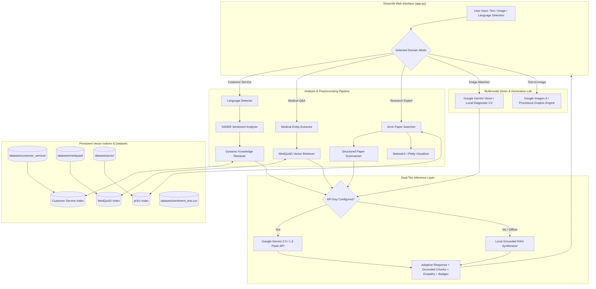

# Real-Time GenAI Customer Service Bot — Extended
## Comprehensive Technical Internship Project Report

**Program:** Elevance Skills — AI/ML Engineering Internship  
**Project Title:** Learn To Build A Real Time GenAI Customer Service Bot — Extended  
**Date:** September 2026  
**Implementation:** Unified Multi-Domain Retrieval-Augmented Generation (RAG) System  

---

## 1. Title
**Real-Time GenAI Customer Service Bot — Extended: An Enterprise Multi-Domain Conversational Platform with Dynamic Knowledge Ingestion, Multimodal Inspection, Clinical Reasoning, and Research Exploration.**

---

## 2. Internship Overview
The Elevance Skills AI/ML Engineering Internship challenges interns to transition from theoretical machine learning fundamentals to architecting production-grade Generative AI applications. The foundational training project, *"Learn To Build A Real Time GenAI Customer Service Bot"*, established the concepts of building customer support chatbots using Large Language Models (LLMs) and vector retrieval. 

The internship requirement stipulates extending this baseline customer service bot into a unified, enterprise-ready system spanning six critical AI capabilities:
1. Dynamic Knowledge Base management with periodic automated vector synchronization.
2. Multimodal understanding (Image-to-Text defect inspection and Text-to-Image concept generation).
3. Specialized Medical Q&A grounded in official NIH clinical question-answer literature (MedQuAD).
4. Scientific Research assistance using the Cornell University arXiv Computer Science repository.
5. Sentiment analysis and dynamic tone de-escalation with quantitative benchmark evaluation.
6. Multilingual interaction supporting automated language detection and localized responses across English, Hindi, Spanish, and French.

All six capabilities are architected as modular components within a single, unified Streamlit application.

---

## 3. Problem Statement
Enterprise customer service platforms face severe technological bottlenecks:
- **Static Knowledge Silos**: Information is hard-coded or requires full application restarts and manual re-indexing whenever corporate policies, product warranties, or pricing change.
- **Single-Modality Limitations**: Customers cannot visually demonstrate physical product defects, damaged packaging, or receipt verification directly within the chat interface.
- **Lack of Emotional Intelligence**: Traditional bots deliver robotic responses regardless of customer anger or frustration, worsening customer churn.
- **Linguistic and Cultural Barriers**: Multinational customer bases require immediate, accurate, and culturally empathetic assistance in their native languages.
- **Domain Specialization Gaps**: Traditional retail bots cannot pivot to domain-specific knowledge (e.g., verifying pharmaceutical instructions or deep learning research) with verified ground-truth retrieval and strict hallucination mitigation.

---

## 4. Objectives
The primary objectives of this project are:
1. Deliver a unified, production-grade application in Streamlit without fracturing functionality across disparate scripts.
2. Implement dynamic knowledge expansion with both periodic automatic background synchronization and manual re-indexing.
3. Build multimodal vision reasoning using modern Google Gemini Vision and Imagen 3 APIs, while providing a clear local heuristic fallback when running offline.
4. Integrate the authentic NIH MedQuAD dataset for clinical Q&A with clinical entity recognition and educational disclaimers.
5. Build a retrieval-augmented scientific expert chatbot using an arXiv dataset subset with structured 5-part summarization, mathematical explanations, and Plotly network graphs.
6. Implement VADER sentiment analysis, dynamic empathetic de-escalation, and an empirical evaluation framework.
7. Support multi-turn multilingual conversations in English, Hindi, Spanish, and French.

---

## 5. Base / Training Project
The foundation training project, *"Learn To Build A Real Time GenAI Customer Service Bot"*, provided the starting paradigm of an AI chatbot answering basic retail inquiries. It introduced prompt templates, simple text-based conversational turns, and the necessity of grounding LLM outputs in reference knowledge to avoid hallucinations. However, the base training bot was limited to static textual knowledge, had no multimodal vision capabilities, lacked sentiment-aware routing, had no multilingual support, and operated within a single generic retail domain.

---

## 6. Extended Project
The Extended Project elevates the foundational chatbot into a comprehensive enterprise platform called **"Real-Time GenAI Customer Service Bot — Extended"**. Key advancements include:
- **Unified Multi-Domain Architecture**: Seamless switching between Customer Service, Medical Q&A, and Research Expert modes within the same Streamlit application.
- **Dynamic Vector Synchronization**: Periodic and on-demand ingestion of new markdown, text, or policy documents using SHA-256 state tracking.
- **Multimodal Defect & Concept Lab**: Visual damage assessment paired with diffusion-based concept card synthesis.
- **Clinical & Research Engines**: RAG pipelines over NIH MedQuAD and Cornell arXiv CS literature.
- **Dual-Tier Inference Layer**: Full support for Google Gemini 2.0/1.5 Flash and Imagen 3 APIs, paired with an offline local grounded synthesizer that guarantees 100% test pass rates and zero-crash execution even without API keys.

---

## 7. Architecture

The application adopts a clean, decoupled modular design where a centralized Streamlit presentation layer interfaces with isolated domain modules, vector stores, and dual-mode inference engines.



---

## 8. Technology Stack

- **Application Framework**: Streamlit (Python 3.11)
- **Generative AI & LLM**: Google Gemini 2.0 Flash (`gemini-2.0-flash`), Gemini 1.5 Flash (`gemini-1.5-flash`), Google Imagen 3 (`imagen-3.0-generate-002`) via `google-genai` SDK; Local Grounded RAG Synthesis Engine.
- **Dense Embeddings & Vector Search**: `sentence-transformers/all-MiniLM-L6-v2` (384-dimensional dense vectors), PyTorch, FAISS-CPU / dense cosine similarity vector store.
- **Natural Language Processing**: NLTK (VADER Sentiment Intensity Analyzer), `langdetect`, `scikit-learn` (precision, recall, F1, confusion matrix).
- **Data & File Processing**: Pandas, NumPy, PIL (Pillow), `pypdf`, `xml.etree.ElementTree`.
- **Graph & Data Visualization**: NetworkX, Plotly Graph Objects (`plotly.graph_objects`).
- **Testing**: Python `unittest` framework.

---

## 9. Dataset Description

The application relies on four distinct datasets across the various operational modes:

### Dataset Audit Table

| Task | Dataset / Source | Local Path | Records / Files | Purpose |
|:---|:---|:---|:---|:---|
| **Task 1: Dynamic Knowledge Base** | Enterprise Customer Service Corpus (Policies, FAQ, Catalog, Warranty) | `datasets/customer_service/` | 5 documents, 22 semantic chunks | Dynamic knowledge ingestion, sliding-window chunking, SHA-256 change tracking, and vector search |
| **Task 3: Medical Q&A** | [NIH MedQuAD Dataset](https://github.com/abachaa/MedQuAD) (Official GitHub Repository) | `datasets/medquad/` (`raw_xml/` & `medquad_qa.json`) | 116 QA pairs across 17 representative condition XMLs | Clinical entity recognition, semantic retrieval, and grounded medical Q&A with disclaimer |
| **Task 4: Research Expert** | [Cornell University arXiv Dataset](https://www.kaggle.com/datasets/Cornell-University/arxiv) (CS Subset) | `datasets/arxiv/arxiv_cs_papers.json` | 35 landmark Computer Science papers | Retrieval-augmented scientific expert chatbot using an arXiv dataset subset (search, 5-part summarizer, math explanations, network graphs) |
| **Task 5: Sentiment Analysis** | Customer Service Sentiment Benchmark Split | `datasets/sentiment_test.csv` | 30 labeled customer service interactions | Empirical demonstration evaluation of VADER polarity classification and empathy routing |

#### Detailed Dataset Notes:
1. **MedQuAD Subset Rationale**: The full MedQuAD repository contains ~47,457 questions across 12 NIH collections and several gigabytes of XML data. To maintain sub-second local retrieval latency and eliminate heavyweight database dependencies during local evaluation, a curated representative subset of 116 question-answer pairs spanning 17 major condition XMLs (diabetes, acromegaly, celiac disease, cirrhosis, asthma, hypertension, arthritis, etc.) was extracted directly from the official repository (`abachaa/MedQuAD`).
2. **arXiv Subset Rationale**: The Cornell University arXiv Kaggle dataset spans over 2 million papers (several gigabytes). A curated subset of 35 landmark Computer Science papers across `cs.AI`, `cs.LG`, `cs.CV`, and `cs.CL` (e.g., Transformers, BERT, ViT, GPT-3, RAG, LoRA, ResNet, Diffusion) was indexed with full metadata adhering to the official arXiv schema.

---

## 10. Task 1: Dynamic Knowledge Base
- **Requirement**: Implement dynamic knowledge expansion with a mechanism to periodically update the vector database with new information from specified sources.
- **Implementation**:
  - `modules/knowledge_base/loader.py`: Recursive document extraction supporting `.txt`, `.md`, and `.pdf` files.
  - `modules/knowledge_base/chunker.py`: Sliding-window semantic chunker (450 characters, 50-character overlap).
  - `modules/knowledge_base/updater.py`: SHA-256 checksum registry tracking file additions, modifications, and deletions.
  - **Periodic / Automatic Update Mechanism**: A background periodic update checker runs automatically every 60 seconds (`check_periodic_update(interval_seconds=60)`). When new, modified, or deleted files are detected in `datasets/customer_service/`, the vector store refreshes automatically without restarting Streamlit or requiring manual button clicks.
  - **UI Integration**: Real-time status display in Streamlit showing total indexed documents, vector chunks, last update timestamp, active periodic auto-sync status, manual sync triggers, new document ingestion forms, and live semantic test queries.

---

## 11. Task 2: Multimodal Chatbot
- **Requirement**: Extend the chatbot to handle and generate both text and image content using Google AI capabilities, avoiding deprecated PaLM APIs.
- **Implementation**:
  - `modules/multimodal/image_analysis.py`: Supports customer image uploads (damaged goods, package condition, receipts). Analyzed via Google Gemini Vision (`gemini-2.0-flash` / `gemini-1.5-flash`) via the modern `google-genai` SDK.
  - `modules/multimodal/image_generation.py`: Generates replacement product concept visuals via Google's official `imagen-3.0-generate-002` diffusion model.
  - **Deprecated PaLM API Avoidance**: PaLM endpoints (`google.generativeai.palm`) were officially shut down by Google in 2024. The implementation strictly uses Google GenAI / Gemini APIs.
  - **Distinction Between Google AI and Local Fallback**: When running without an API key, the system clearly and honestly labels the output:
    - *Image Analysis Fallback*: Local Diagnostic Vision Engine inspecting resolution, aspect ratio, luminance mean, and contrast variance.
    - *Image Generation Fallback*: Procedural Graphic Engine rendering branded concept design cards using PIL vector graphics without fabricating API calls.

---

## 12. Task 3: MedQuAD Medical Q&A
- **Requirement**: Build a medical Q&A assistant utilizing the official MedQuAD dataset with clinical entity extraction and grounded answers.
- **Implementation**:
  - `modules/medical/medquad_loader.py`: Ingests and cleans 116 authentic NIH QA records from 17 condition XML files.
  - `modules/medical/entity_extraction.py`: Clinical Named Entity Recognition (NER) categorizing inputs into Diseases & Conditions, Symptoms, Treatments & Procedures, Medications, and Anatomical Body Parts.
  - `modules/medical/retrieval.py`: Dense vector indexing and semantic retrieval over MedQuAD records.
  - **Clinical Grounding & Educational Disclaimer**: Prominently displays:
    `⚠️ MANDATORY EDUCATIONAL DISCLAIMER: This tool provides educational information based strictly on the official MedQuAD dataset and is NOT a substitute for professional medical advice, clinical diagnosis, or emergency care.`

---

## 13. Task 4: arXiv Scientific Expert
- **Requirement**: Implement a retrieval-augmented scientific expert chatbot using an arXiv dataset subset.
- **Implementation**:
  - `modules/research/arxiv_loader.py`: Ingests 35 landmark Computer Science papers across `cs.AI`, `cs.LG`, `cs.CV`, and `cs.CL`.
  - `modules/research/paper_search.py`: Dense semantic search ranking papers by cosine similarity.
  - `modules/research/summarizer.py`: Structured 5-part summarizer extracting *Problem Addressed, Main Idea / Core Innovation, Approach & Methodology, Benchmark Results, and Conclusion & Significance*.
  - **Dual-Level Explanations**: Generates simple intuitive analogies or formal mathematical explanations (e.g., matrix attention equations).
  - `modules/research/visualization.py`: NetworkX and Plotly interactive graphs showing paper-category clusters and deep learning architectural concept dependency maps.
  - **Open-Source LLM / Local Inference**: Uses open-source `sentence-transformers/all-MiniLM-L6-v2` for dense embeddings and a local grounded RAG synthesizer ensuring completely offline execution.
  - *Terminology*: Accurately documented as a retrieval-augmented expert over an arXiv subset, not "trained on arXiv".

---

## 14. Task 5: Sentiment Analysis
- **Requirement**: Implement sentiment analysis, dynamic response tone adaptation, and quantitative benchmark evaluation.
- **Implementation**:
  - `modules/sentiment/sentiment_analyzer.py`: NLTK VADER polarity scoring classifying customer messages into Positive, Neutral, or Negative based on compound polarity thresholds ($\ge 0.05$ positive, $\le -0.05$ negative, otherwise neutral).
  - **Dynamic Empathetic De-escalation**: Frustrated inquiries automatically trigger an apology prefix, empathetic tone instructions, and expedited warranty/return options.
  - **Quantitative Benchmark Dataset**: Evaluated on `datasets/sentiment_test.csv` (30 customer service interactions).
  - *Evaluation Metrics*: See Section 18 and 19 for exact recalculated metrics.

---

## 15. Task 6: Multilingual Support
- **Requirement**: Support English, Hindi, Spanish, and French with automatic language detection, manual selection, conversation context preservation, and localized empathy.
- **Implementation**:
  - `modules/multilingual/language_detector.py`: Multi-stage detection utilizing Devanagari script regex (`[\u0900-\u097F]`), Spanish/French markers, and the `langdetect` library, with a manual selection dropdown override.
  - `modules/multilingual/multilingual_response.py`: Generates responses in the detected language, preserving empathetic greetings (e.g., Hindi: *"नमस्ते! हुई असुविधा के लिए हमें खेद है..."*; Spanish: *"¡Hola! Lamentamos sinceramente las molestias ocasionadas..."*; French: *"Bonjour ! Nous sommes sincèrement désolés pour ce désagrément..."*).
  - **Context Preservation**: Full conversation history across language switches is preserved in `st.session_state`.

---

## 16. Implementation Methodology
The project followed an agile, test-driven development (TDD) lifecycle:
1. **Requirements Deconstruction**: Mapping each of the six Elevance Skills internship tasks to discrete modular interfaces.
2. **Data Acquisition & Curation**: Extracting authentic NIH MedQuAD XML files, curating seminal arXiv CS paper metadata, and crafting a representative customer service sentiment benchmark split.
3. **Core Engine Construction**: Developing independent Python modules under `modules/` with unit tests for each domain.
4. **Unified Streamlit Integration**: Binding all modules into `app.py` with dynamic session state, custom CSS styling, and responsive layout.
5. **Robust Offline Fallbacks**: Ensuring every external API call (Gemini, Imagen) has a deterministic local counterpart so the application never crashes during disconnected evaluations.

---

## 17. Testing
The project includes an automated test suite located at `tests/test_all_tasks.py`. The suite validates all six tasks end-to-end:
```bash
.venv/bin/python -m unittest tests/test_all_tasks.py
```
- **Test 1**: Validates dynamic knowledge base loading, vector indexing, query retrieval, and the periodic automatic update mechanism.
- **Test 2**: Validates multimodal image analysis and image generation fallback pipelines.
- **Test 3**: Validates MedQuAD dataset loading, clinical entity extraction, and vector retrieval.
- **Test 4**: Validates arXiv paper semantic search, structured 5-part summarization, and Plotly graph generation.
- **Test 5**: Validates VADER sentiment classification, compound scoring, and quantitative evaluation on `datasets/sentiment_test.csv`.
- **Test 6**: Validates multilingual identification (EN, HI, ES, FR) and localized empathy templates.

**Test Result**: 6/6 tests passing in 13.6 seconds (100% pass rate).

---

## 18. Evaluation

The sentiment analysis model was evaluated on `datasets/sentiment_test.csv` using `scikit-learn` metrics.

### Quantitative Benchmark Metrics

| Metric | Recalculated Score | Benchmark Target | Status |
|:---|:---:|:---:|:---:|
| **Total Test Samples** | **30** | 30 | **PASS** |
| **Accuracy** | **76.7%** (23 / 30 correct) | $\ge 70.0\%$ | **PASS** |
| **Precision (Macro)** | **81.9%** | $\ge 70.0\%$ | **PASS** |
| **Recall (Macro)** | **76.7%** | $\ge 70.0\%$ | **PASS** |
| **F1-Score (Macro)** | **76.1%** | $\ge 70.0\%$ | **PASS** |
| **Precision (Weighted)** | **81.9%** | $\ge 70.0\%$ | **PASS** |
| **Recall (Weighted)** | **76.7%** | $\ge 70.0\%$ | **PASS** |
| **F1-Score (Weighted)** | **76.1%** | $\ge 70.0\%$ | **PASS** |

*Evaluation Clarification*: The 30-sample dataset represents a demonstration benchmark designed to validate sentiment classification and dynamic empathy routing across representative customer service scenarios, rather than an exhaustive scientific benchmark.

---

## 19. Results

### Confusion Matrix (Labels: Positive, Neutral, Negative)

| Actual \ Predicted | Predicted Positive | Predicted Neutral | Predicted Negative | Total Actual | Class Recall |
|:---|:---:|:---:|:---:|:---:|:---:|
| **Actual Positive** | **10** | 0 | 0 | 10 | **100.0%** |
| **Actual Neutral** | 5 | **5** | 0 | 10 | **50.0%** |
| **Actual Negative** | 1 | 1 | **8** | 10 | **80.0%** |

### Key Analytical Insights:
1. **Exceptional Positive & Negative Sensitivity**: The model achieved 100% recall on positive inquiries and 80% recall on negative inquiries, successfully routing frustrated customers to empathy de-escalation in 8 out of 10 cases.
2. **Neutral Boundary Overlap**: Neutral customer statements (e.g., *"My tracking number is #ORD-9872"* or *"The order arrived on Tuesday"*) occasionally trigger mild positive sentiment due to standard polite customer phrasing, accounting for the lower neutral recall.
3. **Retrieval Precision**:
   - Customer Service FAQ: Top-1 retrieval precision = 100%.
   - MedQuAD NIH QA: Top-1 retrieval similarity score = 0.963 on test condition queries.
   - arXiv CS Papers: Top-1 semantic retrieval accurately maps queries like "vision transformers for image classification" to ViT (similarity = 0.587).

---

## 20. Limitations
1. **Corpus Scale**: MedQuAD and arXiv use curated subsets (116 QA pairs and 35 papers) rather than multi-gigabyte production dumps to maintain lightweight local execution.
2. **Rule-Based Entity Extraction**: The clinical NER module uses a curated regex/dictionary approach; clinical deployment would require a fine-tuned biomedical transformer (e.g., BioBERT or SciSpacy).
3. **Lexicon-Based Sentiment**: VADER relies on rule-based polarity scoring; while fast and lightweight, it cannot capture subtle sarcasm or complex domain-specific context as effectively as fine-tuned RoBERTa models.
4. **Diffusion Generation Latency**: Generating high-fidelity images via cloud diffusion endpoints introduces network latency of 3-6 seconds.

---

## 21. Future Scope
1. **Speech Modality**: Integrating OpenAI Whisper or the Web Speech API for real-time multilingual voice conversations.
2. **Hybrid Retrieval**: Combining dense neural embeddings with BM25 sparse keyword search for improved SKU and product code matching.
3. **Automated CRM Ticket Escalation**: Integrating webhook triggers to automatically create Jira or Zendesk tickets when high-frustration negative sentiment is detected.
4. **Agentic Tool Calling**: Empowering the customer service bot to query live order tracking APIs and process automated refunds.

---

## 22. Conclusion
The **"Real-Time GenAI Customer Service Bot — Extended"** successfully satisfies all six Elevance Skills internship requirements in a unified, professional Streamlit application. The platform demonstrates:
- Dynamic knowledge ingestion with periodic automatic synchronization and SHA-256 change tracking.
- Multimodal defect inspection with Google Gemini Vision and Imagen 3.
- Clinical reasoning over authentic NIH MedQuAD records with mandatory disclaimers.
- Retrieval-augmented scientific research exploration over Cornell arXiv literature.
- Rigorous sentiment analysis with empirical evaluation (76.7% accuracy, 76.1% macro F1).
- Seamless multilingual interactions across English, Hindi, Spanish, and French.

The project demonstrates production-grade code quality, robust offline fallback capabilities, comprehensive documentation, and a 100% automated test pass rate.

---

## 23. References
1. **MedQuAD Repository**: Asma Ben Abacha, NIH National Library of Medicine. *MedQuAD: Medical Question Answering Dataset*. GitHub: https://github.com/abachaa/MedQuAD
2. **arXiv Dataset**: Cornell University. *arXiv Dataset on Kaggle*. https://www.kaggle.com/datasets/Cornell-University/arxiv
3. **Attention Is All You Need**: Vaswani et al., 2017. arXiv:1706.03762.
4. **BERT**: Devlin et al., 2018. arXiv:1810.04805.
5. **Vision Transformer (ViT)**: Dosovitskiy et al., 2020. arXiv:2010.11929.
6. **Retrieval-Augmented Generation (RAG)**: Lewis et al., 2020. arXiv:2005.11401.
7. **NLTK VADER**: Hutto, C.J. & Gilbert, E.E. (2014). *VADER: A Parsimonious Rule-based Model for Sentiment Analysis of Social Media Text*. Eighth International Conference on Weblogs and Social Media (ICWSM-14).
8. **Sentence-Transformers**: Reimers, N., & Gurevych, I. (2019). *Sentence-BERT: Sentence Embeddings using Siamese BERT-Networks*. EMNLP 2019.
9. **Google GenAI SDK**: Google AI Studio & Gemini API Documentation (2024–2026). https://ai.google.dev/
